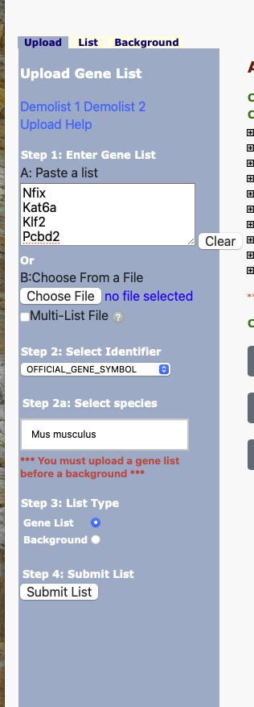
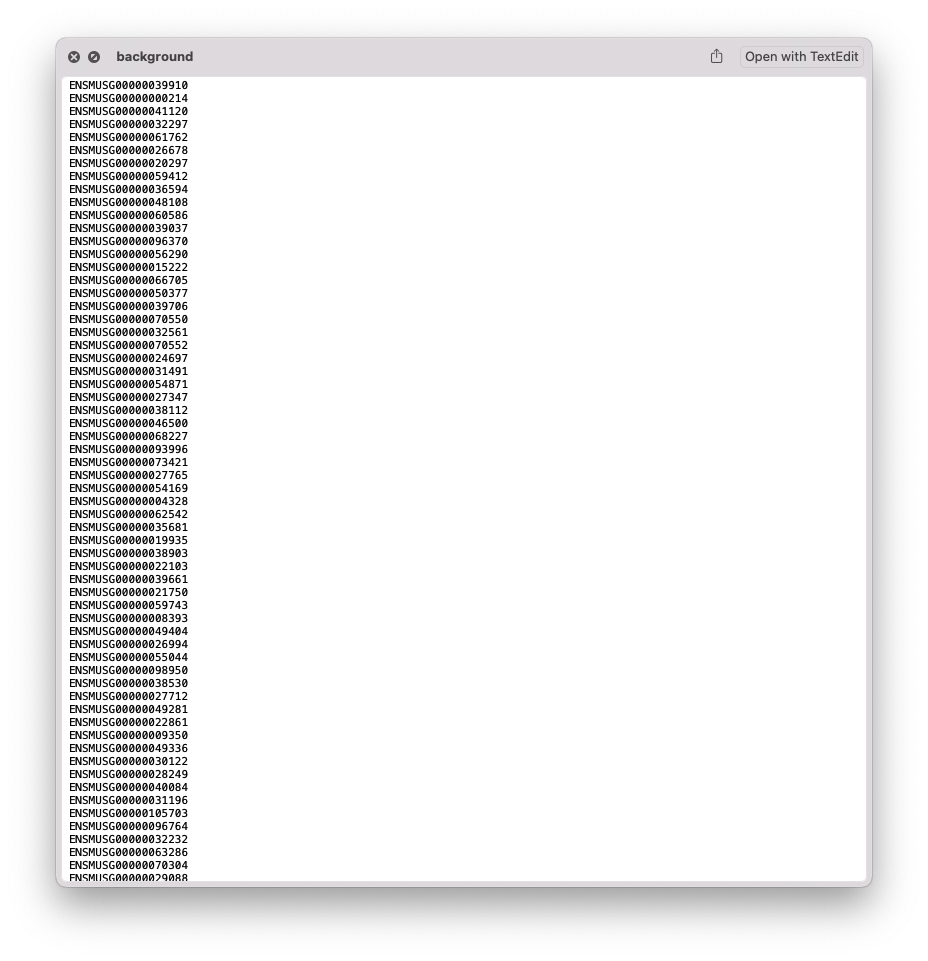
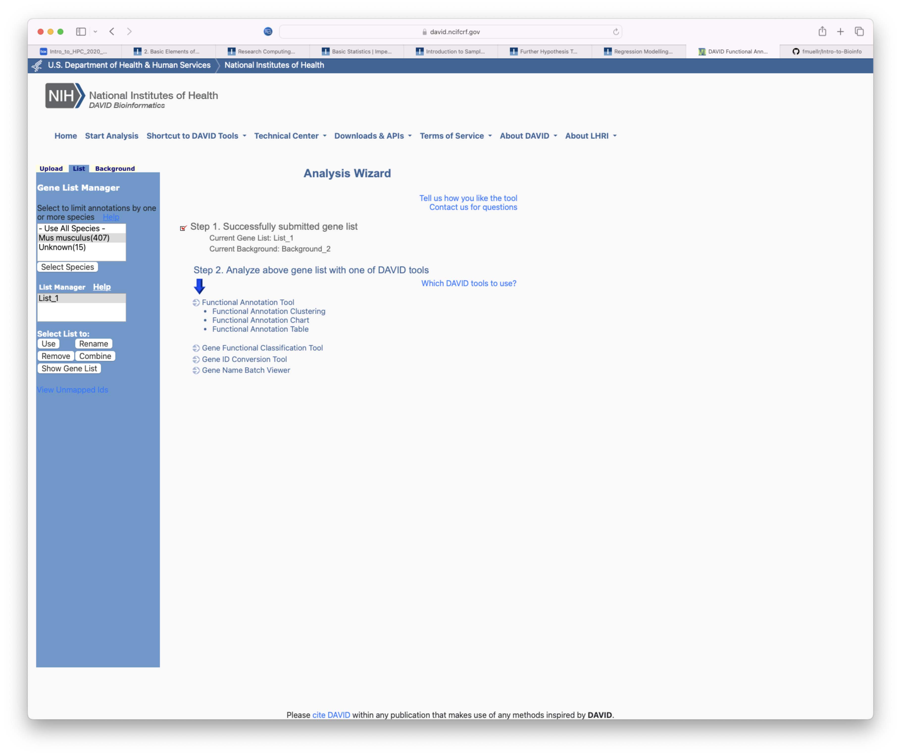
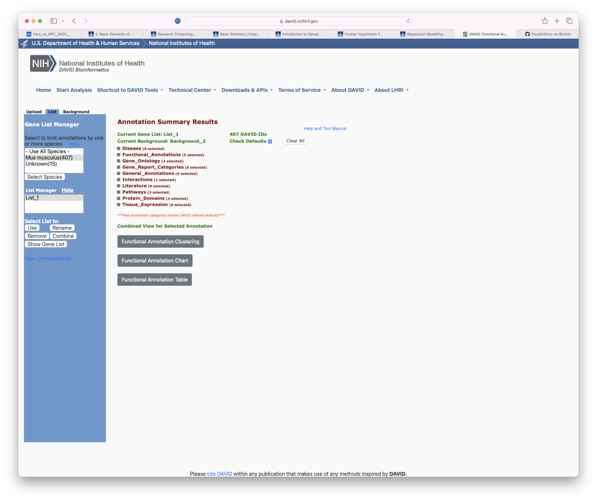
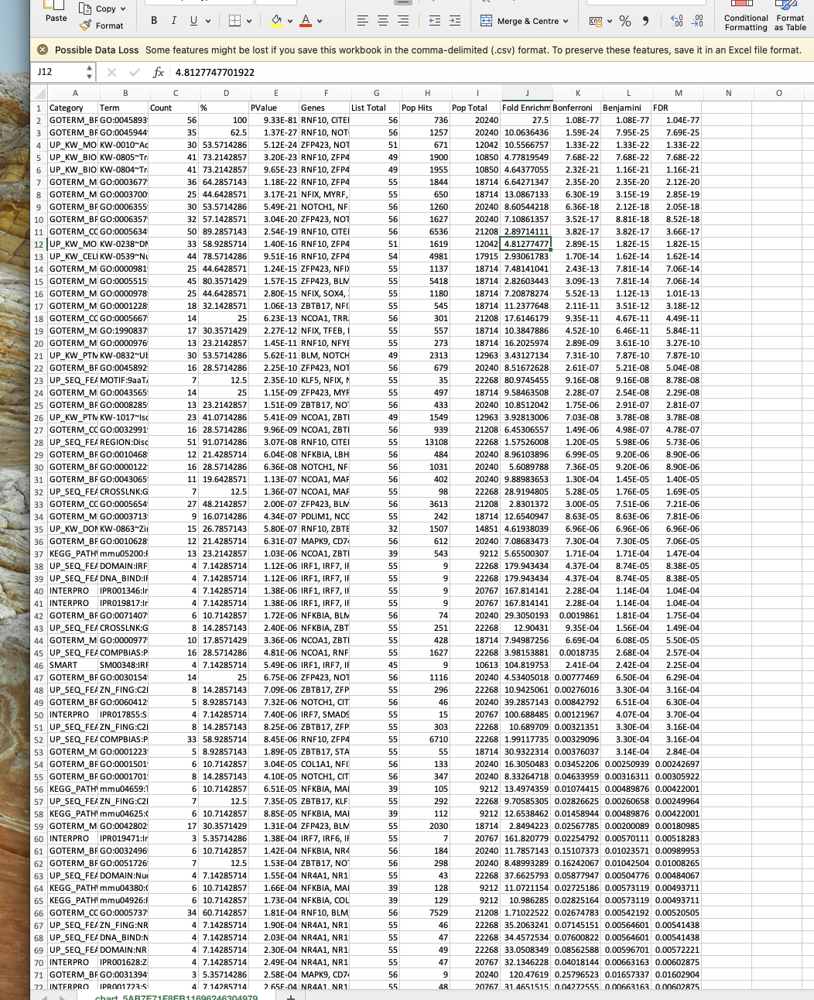
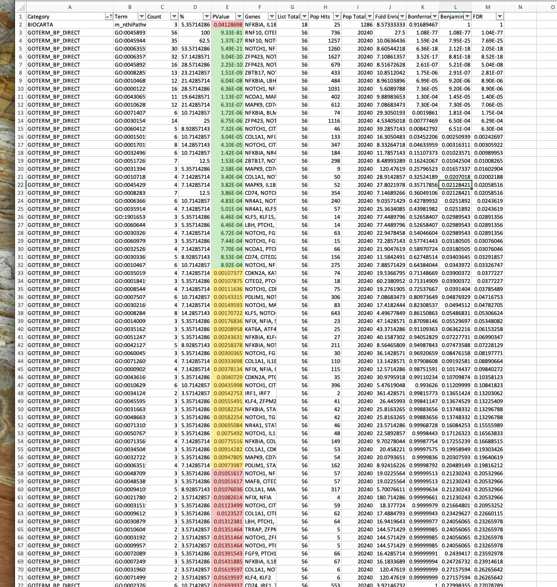
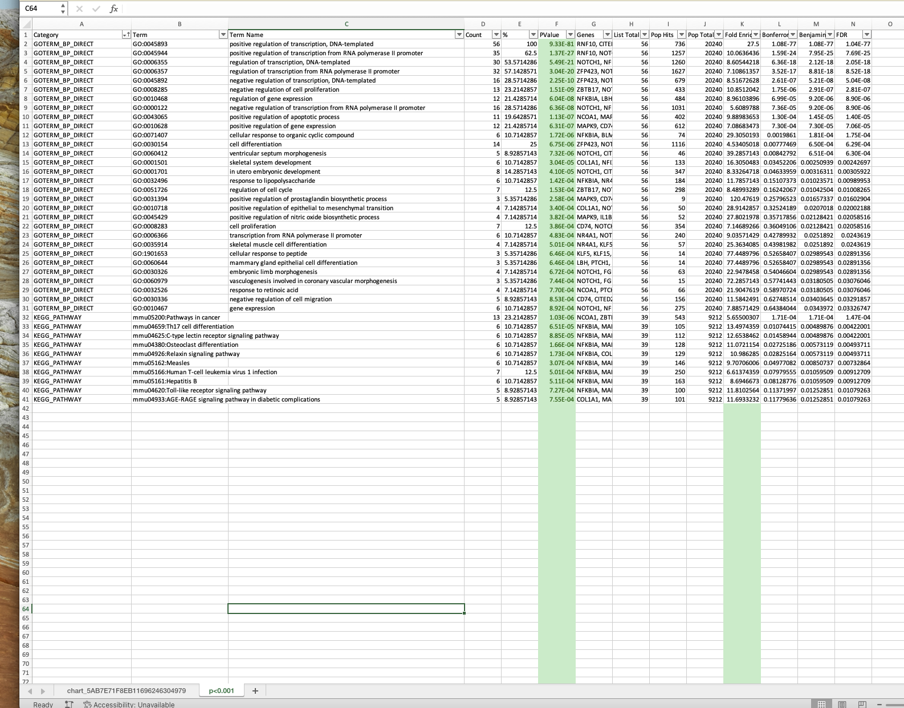
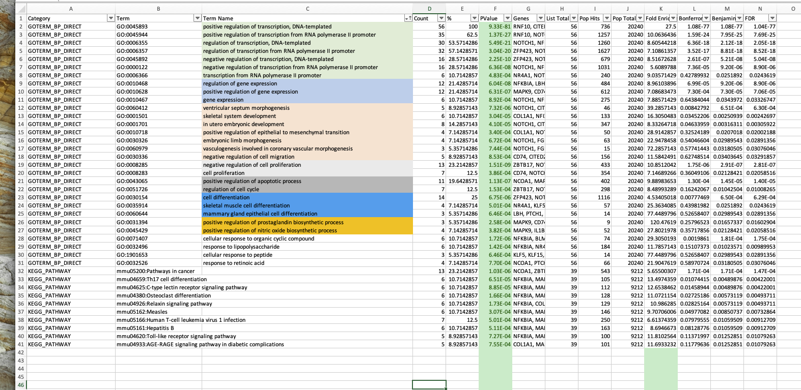
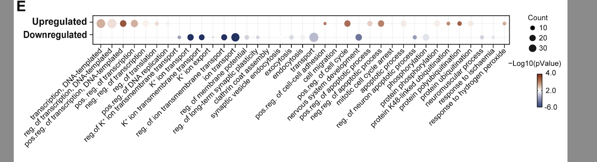

# Gene Set Enrichment Analysis

>  🛠️ Nov 2023

This is an overview of carrying out **Gene Set Enrichment Analysis (GSEA)**, also known as functional analysis, of a gene list of interest. This is particularly useful for example, if you have a list of differentially expressed genes (DEGs) and you are trying to identify what is their function, where are they located etc. 

Functional analysis pulls from two main databases called **Gene Ontology (GO)** and **Kyoto Encyclopedia of Genes and Genomes (KEGG)**.

[GO](https://geneontology.org) is the largest database of information on the functions of genes, including on their **biological process**, their **molecular function**, and their **cellular component**, where these relationships are described in a hierarchal parent-child model between nodes. 

[KEGG](https://www.genome.jp/kegg/) is also a database that describes high-level functions and utilities from the biological system and can include information from the molecular-level, cell, organism, and ecosystem. Often, we use the KEGG pathway as part of our analysis, and it is useful to identify which  genes are involved in which pathways. 

There are two main programs I recommend for this analysis and I will go through how to use both of them. The first is using the [Database for Annotation, Visualization, and Integrated Discovery](https://david.ncifcrf.gov), also known as **DAVID**. The second is a program run in the networking App [Cytoscape](https://cytoscape.org) called **ClueGO**. Both have their pro's and con's, so I usually carry out both sets of analysis and decide which is best for what and how I want to show my data. 

Finally, I will go through how to visualise the results using barcharts, heatmaps, or dotplots. 

## DAVID functional analysis

One of the main benefits of using DAVID is the vast amount of categories that you obtain as well as various statistical and functional analysis options. However, this is also one of its downsides, meaning it requires more effort and time for appropriate visualisation. As well, due to the nature of how terms are names, particularly when using functional annotations known as KEGG pathways, terms can be non-descriptive or false-descriptive (i.e., the name is not appropriate to your list of gene), but more on this later.

First, lets navigate to the [DAVID homepage](https://david.ncifcrf.gov). The click the tab at the top that says *Start Analysis*. You are now presented with a screen divided into two sections: on the left you have three tabs called *Upload*, *List*, and *Background* where you input your data. On the right, you will see the output from your analysis. 

Select your list of interest, for example a list of DEGs. I usually split these into upregulated and downregulated because I am interested in which categories are specifically associated with these different gene states, but this might change depending on your question.

> When selecting your list, you will need to choose the appropriate significance level. Generally, when publishing papers the desired significance cutoff is either FDR<0.1 or FDR<0.05. However, sometimes we use p-value when FDR is too stringent and we loose too many genes. In this case, you could try a p-value<0.001 with a fold change cutoff such as ±0.58, as Log2FoldChange(0.58) = Fold change of 1.5. 

Once you have selected your list and your significance, select either the *Gene Name* or the *Ensembl ID* and paste this into the **Step 1: Paste a list** space. 

> If you are missing the gene name, you can use the [Ensembl BioMart](https://www.ensembl.org/biomart/martview/3fb321400d44779e551346dc093f71c6) to convert the Ensembl ID into gene name. You can also do this in R. 

Once you have pasted the list, we now need to select the appropriate identifier under **Step 2: Select Identifier**. If you have used the Ensembl ID, select **ENSEMBL_GENE_ID**. If you used the gene name, select **OFFICIAL_GENE_SYMBOL**. When using the gene name, you also have an extra step where you need to provide your species of interest, for example Mus Musculus. 

> Sometimes, using the gene name can cause errors, in that case use the Ensembl ID. 

Finally, under **Step 3: List Type** select **Gene List** and then press **Submit** under Step 4.

Now, if you navigate to the *List* tab, you will see it has uploaded your list. You can rename it if you like. Next, we need to upload a **Background**, this is important, because while we can use the provided mus musculus reference, depending on your tissue type, this can slightly vary. The only downside is that because the background is a very large list of genes (usually >20,000), it only lets you submit it using Ensembl ID, meaning that you can't use the Gene name for your gene list. To create your background is very straight forward, select all genes (both DEGs and nonDEGs) from your entire dataset and same the Ensembl ID only in the first column of a .txt file. Or you can paste in the Ensembl ID's under the *Upload* tab. 

Once you have submitted your list of interest and your background, if you look on the right had side under **Analysis Wizard** you should see something along the lines of this:

Here you can see that currently, my list of interest, **List_1** is being analysed with my submitted background, **Background_2**. Click on **Functional Annotation TOol** under Step 2.

Click on **Functional annotation chart**, wait for it to load, and then right click **Download File** and select **Save as** and save it in a folder of your choice. Open this file used **Excel**. When you load it, you will see a large list of Terms amongst other important bits of information. 

The first thing to do is save this file as an excel file. Once saved, we will organise the list. First, we will organise it by category, and then use Excels *conditional formatting* function to select all category with a p-value <0.05, <0.01, and <0.001. I also do the same for FDR. At the end, your list should look like this:

I usually copy this sheet into a new Excel sheet, so that I have an unaltered version of the original table and a new version I can alter. In the new sheet, I remove any categories and any unsignificant Terms from my list. I usually work with two to four main Categories, including **GOTERM_BP_DIRECT**, **GOTERM_CC_DIRECT**, **GEOTERM_MF_DIRECT**, and **KEGG_PATHWAY**. I remove the other Categories. You can keep these if you want, it just depends on what you want to show. I then split the **Term** column into two new columns: **GO ID** and **Name**. To do this, first insert a new column to the right of column B. The select column B, go to Data > text to columns > Delimited > Other > insert **~**, > press finish. Now you can see that for almost all terms, it has split the Term into a GO ID and Name. If you are interested in doing the same for the KEGG category, select all the KEGG Terms, repeat the above step, but under the Delimiter, select **:** and click finish. Now it will have split your KEGG categories as well.

Now copy this data into a new sheet. This will be where we use various p-value or FDR cutoffs from DAVID to determine the best analysis. For this example, I have chosen a cutoff of p<0.0001. Rank you values by p-value, and remove all rows which don't make the cutoff. 

Now comes the tedious part, we will organise our terms by similarity. Some terms you can directly see that they are part of the same group, for example *positive regulation of transcription, DNA-templated*, *positive regulation of transcription from RNA polymerase II promoter*, *regulation of transcription, DNA-templated*, etc. I highlight terms that are part of the same group. If you are having trouble grouping them, you can also have a look at how many genes the have in common by looking into column G. This is why it is easier to use Gene name rather than Ensembl ID, because you can see which genes are in each group and don't need to convert Ensembl ID's into gene names. 

Once you have organised your terms, group like terms with like terms. 

This is the template we use to visualise the functional analysis as barcharts, heatmaps, or dotplots. My preferred visualisation method is to use dotplots, see below for an example. 

## ClueGO functional analysis in Cytoscape

## Interactive network visualisation using GeneTonic

> This requires a dds and DESeq2object, therefore may not be appropriate for all downstream analysis types.
