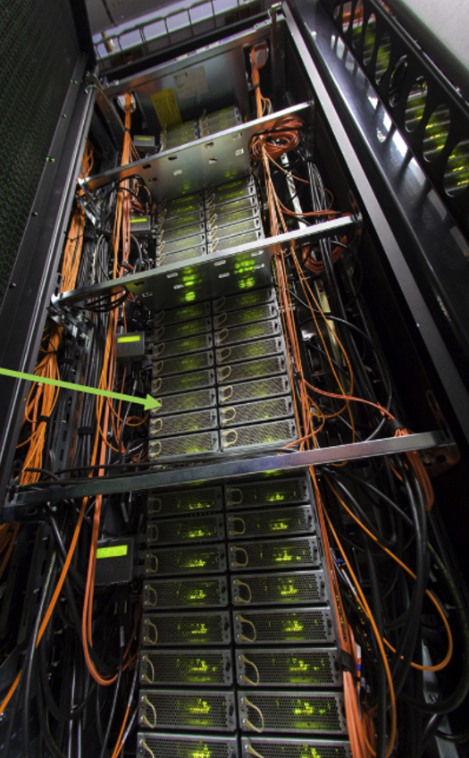
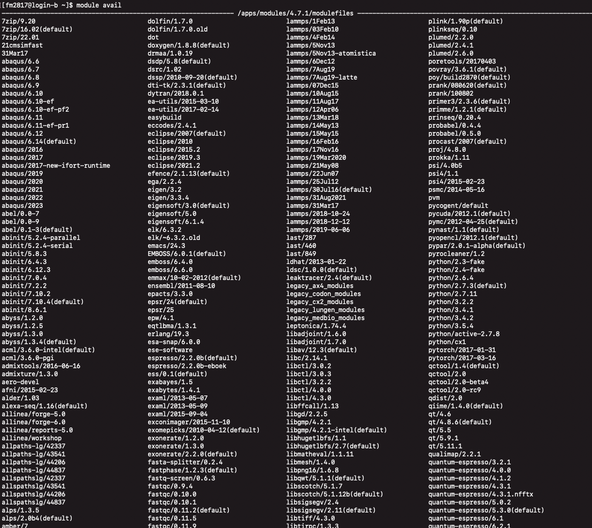
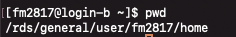

# 👆 Introduction to Bioinformatics: The research data store and high performance computing

An overview to setting up your research data store account and using Imperial's HPC

>  🛠️ Mac Version: Apple M1 Max, Ventura 13.5.1 // Oct 2023

## HPC account setup
Setting up your High Performance Computing account at Imperial is essential. This will allow you to carry out intensive and complex tasks using your laptop or computer without requiring high processing power. 

You will need to discuss setting up your account with your PI or a user who has admin authorisation to add you to the list. Simone already has an account **hpc-sdigiova**. If you are a post-doc, PhD, and research postgrad student, you will need to ask Simone to register you. This can be done by following the instructions for [Get Access](https://www.imperial.ac.uk/admin-services/ict/self-service/research-support/rcs/get-access/) under *Get access to High Performance Computing* and selecting *registering members of your group*.  
Next, your PI or admin user should  set up a research data store (RDS) project for you. This is a 2 TB space you can use to store, analyse and process your data. This can either be set up as your personal space or as a collective space which multiple users can access - this will change depending on the nature of your project. 

There are no [charges](https://www.imperial.ac.uk/admin-services/ict/self-service/research-support/rcs/service-offering/charging-structure/) associated with account creatio, however the RDS project has a monthly charge, though it is very low. 

### Connecting to the RDS
To connect to your project, there are several options. If you are working within the Imperial network, make sure you are connected to **Imperial-WPA wifi**. If you are doing this outside of the Imperial network, turn your VPN on - see below. 
The first and easiest is to connect using [*Connect to server...*](https://wiki.imperial.ac.uk/display/HPC/RDS+on+macOS) which will allow you to view and access your files, but not perform any analysis. For that we need to use the Terminal. 

- Select *Go* from the finder menu
- Select *Connect to server...*
- Enter the RDS Directory Path in the Server Address box in this format: `smb://rds.imperial.ac.uk/rds/user/<username>`. For example, in my case this would look like: `smb://rds.imperial.ac.uk/RDS/user/fm2817`. You may be prompted to input your imperial user name (full email, e.g. fm2817@ic.ac.uk) and password.
- This will bring up a window where you have three folders, **ephemeral**, **home**, and **projects**. Your two most important folders are your **home** and **projects** folders.

### Accessing the HPC off campus
As you might be off campus to do some of this work, you will need access to the Imperial network in order to access the system and use its facilities. 

While Imperial is rolling out its new Unified Access, just use [OpenVPN Connect](https://openvpn.net/client/) instead.  Download it and follow the instructions. When you use it the first time, you will need to download and open the OpenVPN configuration files found [here](https://www.imperial.ac.uk/admin-services/ict/self-service/connect-communicate/remote-access/virtual-private-network-vpn/). Under MacOS, click **download the OpenVPN** file. Once downloaded, click it and it should open in OpenVPN connect. Connect using your college username and password. 

## But what even is the HPC?
Before we go into further detail, let's understand some basics. This information has been adapted from the [Beginner's guide to HPC at Imperial](https://imperialcollegelondon.app.box.com/s/fsoiljuf43f7ko4tfvqifbyrfj8yslbi). 

Bioinformatic analysis can persist of intensive, large scale data modeling requiring a lot of computing power. This is where Imperial's HPC cluster comes into play. A **computer cluster** is a set of connected computers that work together as a single system. The main advantage of using this system is that you can run programs, which process large bits of information in parallel, cutting down the time required to analyse your data. 

. 

Inside of one of these computer racks, there are individual computers, also known as **nodes**. 



Nodes are made up of multiple **cores** that can access the same memory. A core is the basic computation unit inside a processor that can run a single process. Imperial's HPC processors contain up to 14 cores. This means that 14 parallel processes can run at the same time, accessing the same memory, to carry out analysis. 

Some other terms to know are:
- A **Job** is a program you run on the cluster
- When you **submit a job**, you are providing a set of instructions to the computer cluster to run your programs. 
- **Memory** refers to the main memory also known as **RAM**, which is the fast memory directly connected to the processor. When you run a program, it uses this space to store any temporary data it requires to carry out its analysis. 
- **Serial code** refers to running a program on one core. 
- **Parallel code** refers to running a program on two or more cores.  

Some examples of different types of jobs you can run include:

- High-throughput tasks - when you are running a large number of relatively small jobs
- Parallel jobs on a single node (threaded)
- Parallel jobs on multiple nodes (from 2 to 270 nodes)
- Large single node memory jobs (up to TBs of memory)
- Jobs using GPUs (such as machine learning tasks)
- Long-running jobs (up to 1000 hr)

## Using the cluster
All computers in the HPC resource are connected to one parallel file system - the Research Data Store. This gives you access to:

- your home directory `$HOME`- personal working space; 1 TB allocation (up to 10 mil files)

- temporary storage `$EPHEMERAL` - additional individual working space, unlimited allocation, but files are deleted after 30 days

- allocated project space `$RDS_PROJECT` - your project allocations. 

As the HPC system is a linux-based operating system that uses the Unix shell language **Bash**. Bash is also called a command-line interface or command-line language and the main way we will be interacting with the HPC is by using the **Terminal App** on our Mac laptop (Windows users, I think you're equivalent is PowerShell).

The first thing you want to do is open you Terminal App on your Mac laptop (or windows equivalent). You can do this by pressing the command key and the space bar, then type in Terminal, and hit enter. If you are using a macOS version Catalina or newer, you will notice that instead of bash, your terminal runs **zsh**, also known as Zee shell, which is an improved and expanded version of Bash. This should make no difference when running your commands, especially since the majority of the work will be directly on the HPC's system. 

Next we want to login to your person RDS space. To do this type in the Terminal: `ssh your_username@login.hpc.ic.ac.uk`. Replace "your_username" with your Imperial username. You will then be prompted to enter your Imperial password. Do this and hit enter. If you are working from home, make sure your VPN is turned on and connected to Imperial,otherwise you will not be able to access the RDS. 

> You will notice as you type your password, you will not see any letters being typed. This is done for security purposes to protect your personal information. 


You will now see a screen which gives you an overview of your project allocations and your individual allocations. You can see how much space is left in each of your projects and your home folder. I will discuss the individual folders in more detail below and what to do if you run out of space and archiving projects. 

You will also see a box that contains some information. One of these is to remember, when you have logged in to the RDS, you are logging into a space that is shared amongst all users (i.e., it is a shared computer space). This means that you SHOULD NEVER run any jobs directly in this space, as it will slow down or prevent other users accessing the login nodes. This will make more sense later on when we submit our first job. 

You will also find some website links where you can check information and the service status of the RDS.


You can view which login node you are connected to by typing `hostname` and hitting enter. This is useful if, for example, you are having issues, occasionally some login nodes fail due to various issues, and in this case I'd recommend disconnecting and then reconnecting. 


Here you can see I am currently connected to login node **login-b**. If you type in `who | wc -l` you can also check how many people are connected to that login node to see if its currently under heavy usage. In the example below, I can see that 105 other users are currently connected to the same login node. 


## Running our first job
Great, now that you're logged in, let's set up our system and run our first job!

The main programs that we will be using are R, python and the command line to execute our jobs. When we submit a job, we are going to do this by instructing the **cluster resource manager** to execute our job. This is essential, as mentioned above, you do not want to run a script directly on your login node, no matter how small or quick, because there are only a certain number of login nodes. If all users computed here, the nodes will be overwhelmed and the rest of the cluster will be idle. 

Instead, the cluster resource manager takes care of sorting your requests into job classes, scheduling your requests, starting jobs when computing resources become available, monitoring jobs, and producing jobs. To communicate with the resource manager, we will need to write a **shell script**, something I will also be referring to as your **PBS script**. This instructs the resource manager what to do and what requirements you need. Passing your finished script to the resource manager is called **submitting a job**. 

The resource manager needs to know your **command** and also what **resources** your job needs. Every job script must also include the **run time**, **memory** required, and the number of **cores** it needs to run the job.

It's important that you correctly select your resources, which sometimes require a bit of trial and error, especially when running new programs. If the resources you request are exceeded while the job is running, then the job is terminated. Also remember that the longer the job takes, the longer you have to wait for it to start. 

Now, before we submit our first script, we want to make sure certain programs are set up. 

When you submit a script, you will ask it to load a **module** to set the environment to use a software package. Think about this like an App; if you want to write a document, you will open Word (the module); or, more complex: if you want to carry out a t-test, you will first need to Open Excel (the module) so that you can input your data and instruct excel to carry out the analysis.  Similarly, if you want to use a certain software program to do specific analysis, you will need to load it first. In this case, module refers to a pre-installed program in the HPC system. In your Terminal, type in `module avail` to show a list of all modules available from the HPC (might take a sec to load).



You can scroll through and see that the HPC has a ton of available resources already for you to load and use. However, some specific packages are not available through the HPC directly and while you can submit a request via [ICT ASK](https://imperial.service-now.com/ask) and search for "RCS Software Install Request", it is quicker and easier to either directly install packages into your home directory or check if they are available through **Anaconda** and install them. 

Some basic commands when looking at modules. 

- List all modules available: `module avail`
- Find a module for your software: `module avail your_software`
- Load a module: `module load your_software`
- Load a specific version: `module load you_software/version_number`
- List all loaded modules: `module list`
- Swap modules: `module switch your_software your_software/version_number`
- Unload a module: `module unload your_software/version_number`
- Get rid of all loaded modules: `module purge`

> Where it refers to loading and unloading a module, think about this as opening and closing an App. 

### Setting up Anaconda
**Anaconda** is one of the main modules I use to install many different software packages. I will discuss how to use it in more detail below, but we will need to set it up before we use it. You will only need to do this once. 

In the Terminal, type in:

```bash
module load anaconda3/personal
anaconda-setup
```

This is done only once. Afterwards, use `module load anaconda3/personal` to setup your personal python environment. Next, to activate anaconda, you will either need to enter `source activate` or `conda activate` depending on the version you have (try both, see which works for you). Once you do this, you will now see that your Terminal prompt has changed to say: `(base) [fm2817@login-b ~]$` for example. 


Anaconda is great because it enables you to create separate environments that contain specific software packages for your projects. This helps to keep everything organised but more importantly, lets you using different versions and avoid something known as dependency conflicts (more later). Frustratingly, not all software developers maintain their software up to date. This means that sometimes software will no longer work if, for example, it is no longer compatible with an updated programming language. To avoid these issues, you can create an environment in Anaconda which serves as a separate, isolated space where you can load older versions which are compatible. 

***Setting up R in Anaconda***

R and R libraries can be installed using your personal Anaconda. While you can load R modules from the HPC, I find that they don't maintain it up to date and I prefer to start off by using the most recent version of R.

To do this we want to set up an environment in Anaconda that contains R. 
First we want to create an environment and name it (choose your name wisely - you will need to input it each time you want to load it). If you ever forget what environments you've created, you can simple type in `conda info --envs` to obtain a list. 

> A note on naming files, folders, etc: NEVER use a space, instead use _ or similar. Trust me, spaces will only make your life difficult. 

For example, in my case, I called my R environment "r_env": `conda create -n r_env`. 
Then we want to activate it: `source activate r_env`. When you hit enter on this command, you can now see that instead of (base) the environment has now changes to (r_env). 


Now we need to install R. To do this, we first want to configure our channels so that we can use the **conda-forge** channel. Conda channels are basically locations were packages are stored and managed. The conda-forge channel is one of the biggest and best channels to download packages from because they are maintained up to date and is free to use. Use:

```bash
conda config --add channels conda-forge
conda config --set channel_priority strict
```
You can always change the priority from strict to flexible later if required - this is explained in more detail [here](https://conda.io/docs/user-guide/tasks/manage-channels.html), but not required at this time.

Now we can install R from the conda-forge channel; type in `conda install r -c conda-forge`.
We also want to install some essential packages in R that we will use:

```bash
conda install r-essentials e-base
conda install r-dev-tools 
conda install r-biocmanager
```

### Running our first script
A quick recap: 
As I mentioned before, the resource manager takes care of sorting your requests into job classes, scheduling your requests, starting jobs when compute resources become available, monitoring jobs, and producing jobs. To communicate with the resource manager, you need to write a shell script (aka a job script) instructing the resource manager what to do for you. Passing your finished script to the resource manager is called **submitting a job**.

The resource manager needs to known your *command* and also what *resources* your job needs. Every job script must also specify *run time*, *memory (RAM)*, and *number of cores needed* to run the job. If the requested resources are exceeded during the job run, the job is terminated. The bigger the resource, the longer the wait for a job start.

**Lets try an example - hello hpc!**

First let's create a new working directory in our home folder in the RDS. We can do this by using the Terminal to interact with the RDS. Use the command `pwd` (aka print working directory) to check where in the RDS system you are located. Unlike when you use your laptop to open a finder window and scroll through your folders, when you are interacting with the RDS through the Terminal, you cannot visually see which folder you are in. By using the `pwd` command, the system tells us where we are. After typing this in you should see something like this: `/rds/general/user/your_username/home`



We are now locating in your *individual allocation* also known as your home folder. This is where you will store scripts, PBS scripts, log and error outputs and where you can also store any software you might need. Now let us create a new folder called "test". To do this use the command `mkdir test`. This is telling the system to make the directory test. A directory is another name for a folder. Now you need to navigate into that directory. To do this we will use the command `cd test`. This is telling the system to change the directory to test. If you run `pwd` again, you will see that you are in `/rds/general/user/your_username/home/test`.

If you want to go back to your home folder, we can use `cd ..`. This might look a bit strange with all the periods, but what this represents is from your current folder **(cd)**, move back one **(..)**. 

In your home folder, if you now type in `ls`, you will now see a list of your files and folders in your home folder. You should see the test folder in this list. 

To reenter the test folder, we can use `cd ./test`, meaning from your current folder **(.)**, move **(/)**, into the test folder **(test)**. 

This is how we will navigate within the system. If you are struggling to visualise where you are, you can always look at your RDS folders by using GO > Connect... (see [Connecting to the RDS](#connecting-to-the-rds)). 

Basic Bash commands:
- `pwd`: print working directory - identify where you are currenty located
- `mkdir <name>`: make a new folder with a name of your choice. 
- `cd <PATH_TO_FOLDER>`: change the directory to a new directly. 
- Use `./` or `./..` to navigate between your folders. 
- `ls`: list files in your current folder. 

Check out Code Academy's [list of command line commands](https://www.codecademy.com/article/command-line-commands) for some common commands. 

Next, we will create our job script using the text editor called Nano. To open Nano, in the Terminal type open up Nano. Do this by typing in `nano` and hit enter. 

Imperial's HPC uses a resource manager called the *Portable Batch System* or PBS. This system is basically a scheduler, which manages the distribution of jobs across the available nodes in the cluster. This system tries to make the HPC network the most efficient it can be by calculating the best possible allocation of nodes and their resources to the users that need them without having any resources unused and as little waiting time as possible for the users. 

This means, before any script, we need to include commands to the PBS system, telling it how long the job should run for and how many resources it needs. We do this by writing a Shell script, for example, in nano type in the following:

```bash
#PBS -l walltime=00:10:00 
#PBS -l select=1:ncpus=1:mem=1gb 
module load hellohpc <-load software
hellohpc.py <- your command
```


Now hit control+O to save and give the document a title, eg. submit.pbs. Then hit enter and hit control+X to exit nano.

Now you are ready to submit your job. First let's check what the job is again and to check for any errors. To do this, use `cat submit.pbs`.

This should print the job script you just wrote. Now let us submit the script using `qsub submit.pbs`. This should give you a job ID, eg. 126610.pbs.

If you want to check the status of your job, use `qstat` to check IDs for all jobs, or `qstat job_ID` for a specific job ID. Use `ll *job_ID` to check the output of you submit.

A little more info about PBS aka **Portable Batch System**. This is a system designed to manage the distribution of batch jobs and interactive sessions across the available nodes in the cluster. Below, I've included some basic commands to know.

**Resource manager commands:**

- `qsub your_script` - submit your job and system returns a job id
- `qstat` or `qstat job_ID` - short overview of your jobs
- `qdel job_ID` - to remove a job from the system
    
    <aside>
    💡 Note: it takes a few minutes for you to see an update.
    
    </aside>
    
- `ll *job_ID` - to check the files produced: the top file are any error messages that may have occurred; the bottom one is the screen output and resource manager messages.
- `more filename.pbs.oxxxxx` - to view your text file `o` Check that it's the file number starting with o and not e.

**Syntax:**

The system expects the following syntax at the ***top*** of your job script:


### Transferring files between your computer and the HPC cluster 

#### Using Globus

#### Using FileZilla
> reference to geo transfer. 

